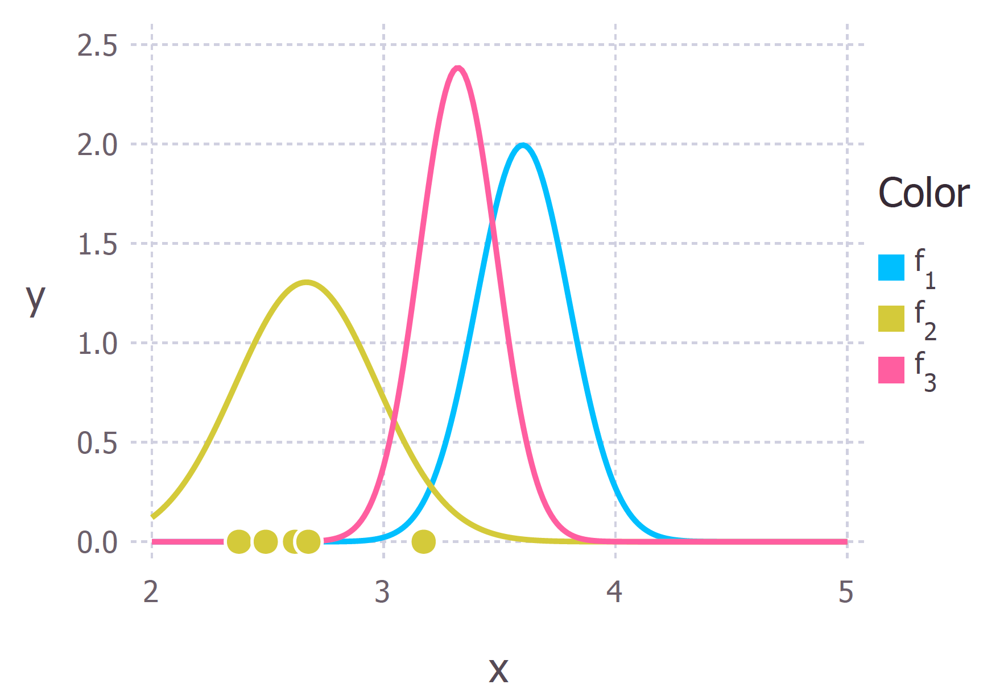
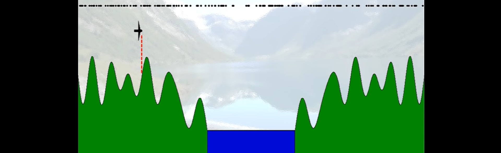
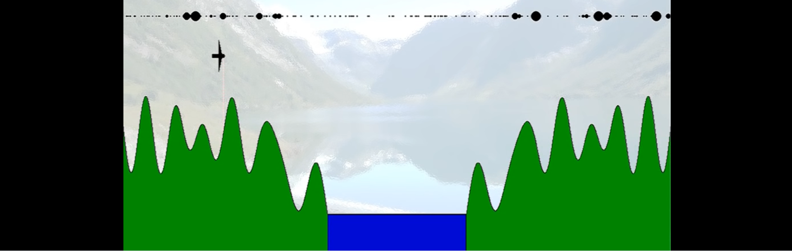
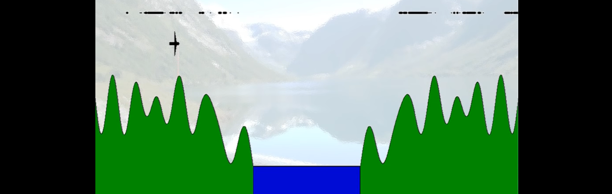
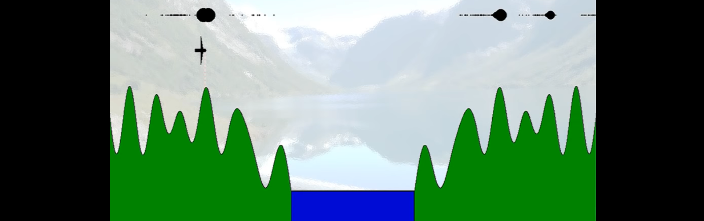
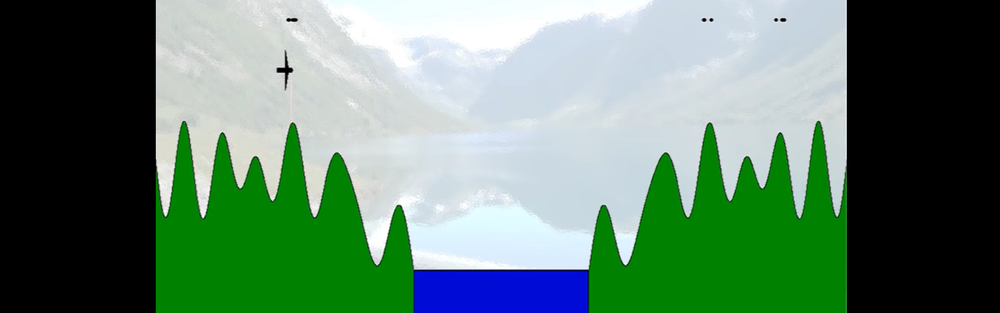
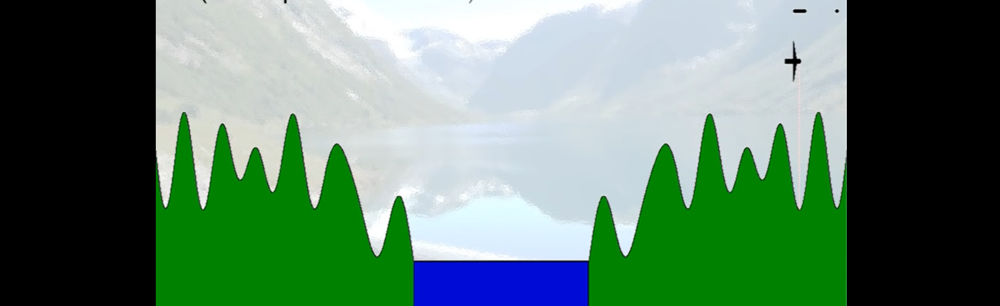

```{r setup, include=FALSE}
knitr::opts_chunk$set(echo = FALSE)
```

## Filtering Problem

**Particle Filters** (also known as Sequential Monte Carlo or SMC) are a set of algorithms that are used in signal processing to solve a so-called *filtering problem*.

$$
\begin{aligned}
&X_1 \hspace{0.3cm} \rightarrow \hspace{0.3cm} X_2 \hspace{0.3cm} \rightarrow  \hspace{0.3cm} X_3 \hspace{0.3cm} \rightarrow \hspace{0.3cm}\ldots \hspace{0.3cm} \text{hidden states} \\
&\downarrow \hspace{1.4cm} \downarrow \hspace{1.41cm} \downarrow \hspace{0.3cm} \\
&Y_1 \hspace{0.3cm} \rightarrow \hspace{0.3cm} Y_2 \hspace{0.3cm} \rightarrow  \hspace{0.3cm} Y_3 \hspace{0.3cm} \rightarrow \hspace{0.3cm}\ldots \hspace{0.3cm} \text{observations}.
\end{aligned}
$$

Applications of particle filters range from physics and statistics to robotics.

## Key Concepts: Conditional Probability

In the simplest terms conditional probability is a measure of the probability of an event occurring, given that another event has already occurred.

**Example:** Let's say we know that on any given day the probability of person coughing is 5%. Or in mathematical notation $P(\text{Cough})=0.05$. 

We also know that the probability of coughing is much higher if you are sick with COVID. Let's say this *conditional* probability is 75%, or in mathematical notation $P(\text{Cough|Sick})=0.75$.

## Key Concepts: Bayes' Theorem

**Bayes' Theorem** is used to compute a conditional probability of an event given certain known preconditions. Mathematically it is stated as

$$
P(A|B)=\frac{P(B|A)\times P(A)}{P(B)}.
$$

Continuing the previous example let's say that the probability of having COVID in the first place is 0.1% or $P(Sick)=0.001$. 

Now we can use Bayes' Theorem to calculate the probability of a person having COVID if he or she coughs:

$$
P(\text{Sick|Cough})=\frac{P(\text{Cough|Sick})\times P(\text{Sick})}{P(\text{Cough})}=\frac{0.75 \times 0.001}{0.05}=0.015.
$$

## Key Concepts: Probability Distributions



## Filtering Problem

To solve the problem we need to know how the observed variables are linked to the "hidden variables" and something about the probabilities of observed state variables. These are represented by the following *statistical models*:


$$
\begin{aligned}
&x_{k+1} \sim p(x_{k+1}|x_k)\\
&y_{k} \sim p(y_k|x_k).
\end{aligned}
$$

The state of the hidden process at time $k$ is denoted as $x_k$ and the observed process as $y_k$. These are used for computing the *posterior distribution* $p(x_k|y_{1:k})$.

## Positioning

**Example:** We want to estimate the location of an airplane in a 2D world when the following is known:

- altitude,
- distance to the ground
- and we have a topographic map (but we don't know our location on the map).

The pictures below lifted from the animation **Particle Filter Explained without Equations**, \textcolor{blue}{https://www.youtube.com/watch?v=aUkBa1zMKv4}.

## Positioning



## Positioning



## Positioning



## Positioning



## Positioning



## Positioning



## Some Literature

- Gustafsson (2010): **Particle Filter Theory and
Practice with Positioning
Applications**, \textcolor{blue}{https://ieeexplore.ieee.org/document/5546308},
- Wikipedia: **Particle filter**, \textcolor{blue}{https://en.wikipedia.org/wiki/Particle\_filter}.
